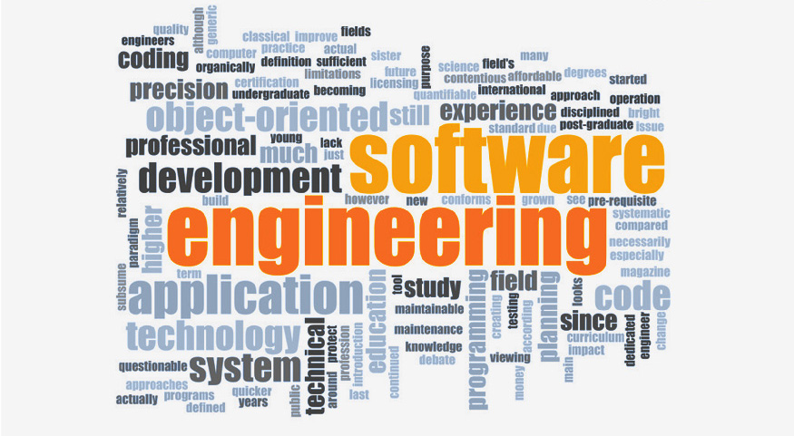

## My Journey

When I was younger, I never really questioned how websites functioned, let alone the intricacies of the internet itself. I simply took them for granted as part of the way the world worked. However, as I embarked on my exploration of computer science, I began to appreciate the vast and interconnected nature of this field. Although I often find certain concepts, especially those related to coding, challenging to grasp, I am continually fascinated by the remarkable ability to create virtually anything that this field offers. The power to bring ideas to life through technology is truly incredible.

## Future Plans

Firstly, my goal is to enhance my proficiency in programming languages such as Python, Java, and JavaScript. Additionally, I intend to deepen my understanding of software architecture and design principles, with the aim of creating scalable and maintainable systems. Furthermore, I am eager to expand my knowledge in emerging technology areas such as Artificial Intelligence and the growing importance of cybersecurity. Gaining expertise in these fields will undoubtedly benefit me in the future.

## What Now

Many concepts in computer science are skills, not innate talents. To enhance my proficiency in software engineering, I have a clear plan: consistent practice of the concepts I learn from this point forward. Collaboration will be a cornerstone of my journey toward becoming a better software engineer, so I intend to become more open to asking questions and generally be more approachable. With time and dedication, I am confident that I will gain the self-assuredness in my skills that I aspire to; it's a journey that will require patience and persistence.