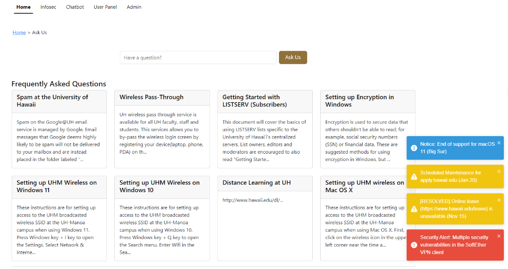
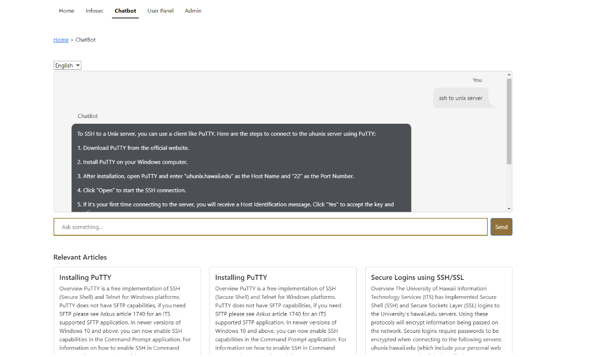

## Project Overview
The "Ask Us" page, an integral component of the University of Hawaii's website, currently faces challenges. Its existing structure tends to overburden support staff, leading to delayed responses and increased workloads. To address these issues, an upgrade in the system is essential for enhancing both efficiency and the user experience.

To this end, we developed the UH ITS Ask Us AI chatbot. This advanced tool is designed to transform user interaction with the support page. As a sophisticated virtual assistant, it can swiftly navigate through an extensive database of articles, providing accurate and quick answers to user queries. This enhancement significantly speeds up information retrieval, making the process more user-friendly and efficient.

## Solution Approach
Our task was to leverage the UH ITS database, training the AI to answer a wide array of potential questions related to this resource. But our ambition went beyond mere functionality; we aimed to create a memorable user experience. To achieve this, we incorporated multilingual support, a history review feature, and a system for users to rate the chatbot's responses.

## My Responsibilities
In the development of this project, my primary responsibility was on the front-end development, focusing on user interaction with the website. I ensured that our design aligned with the established University of Hawaii website theme, creating a seamless integration rather than a disconnected standalone website.

## The Takeaway
This project was a significant learning experience, especially in terms of team dynamics. We faced challenges, but instead of discouraging one another, we chose to support and collectively overcome obstacles. Breaking the project into three major milestones was beneficial, as it allowed for effective task delegation. This approach ensured that everyone contributed meaningfully, culminating in a website that we are all proud of today.

To view everything about this project consider visiting our [homepage](https://regex-ics314.github.io/)
