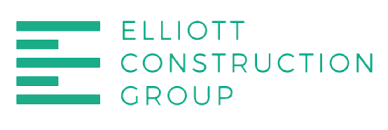

While painting has no correlation to software development and enginnering I still learned important qualities from my experiences that I can apply to the field. First of all I should clarify that my father works as an industrial painter and has worked all kinds of different types of jobs. Whether it be inside or outside, houses or hotels, renovations or construction sites. 

One skill that is required is oral communication. Talking to people to ensure that you understand what the customer wants and how your going to achive it is a must. Without it this will lead to mistakes which take time and money to fix depending on how bad it gets. The same can be applied to software development where people must collabarate ideas and or understand what a project entails.

Another trait that is important to have is time managament. Sometimes my father gets swamped with different job sites that he has to go to with varrying deadlines. It's important that he knows when and what he needs to be doing at any given moment. Having good time management will only help me on to succeeding my tasks that I need to achive as a software engineer. I will be able to break down projects and prioritize what needs to get done.

Finally problem solving is an important skill to have in both fields. Finding away to work around problems is paramount to success. Finding ways to speed up processes or to keep calm during stressful situations is always a skill that will come in handy. Especially in the development phase there is always something that goes wrong. Finding solutions and remebering what went wrong is a great skill to have.
